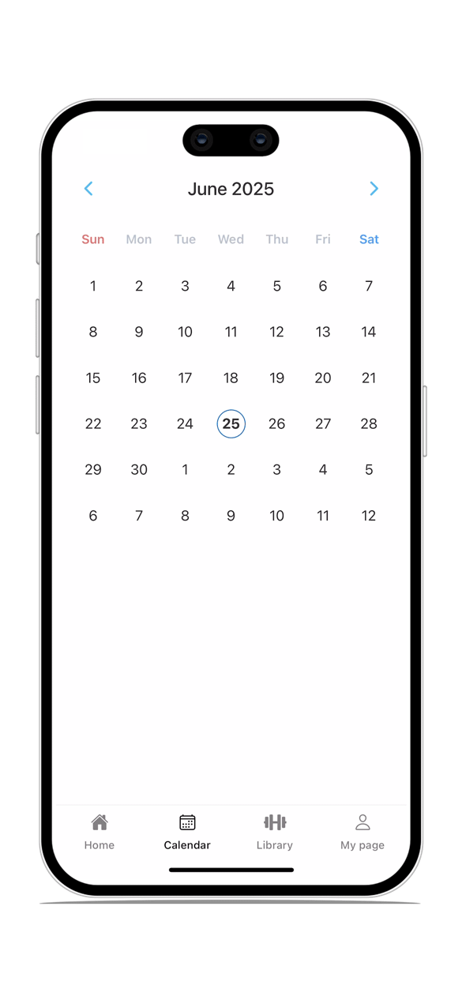

# Calendar App

A modern, interactive calendar application built with React Native and Expo. This app provides an intuitive calendar interface with smooth animations and gesture-based navigation.

## Features

### 🗓️ Interactive Calendar
- **Date Navigation**: Easy month/week navigation with arrow buttons
- **Gesture Navigation**: Swipe horizontally to navigate between months/weeks
- **Date Selection**: Tap to select dates with visual feedback
- **Today Highlighting**: Current date is automatically highlighted
<p align="left">
   &nbsp;&nbsp;&nbsp;&nbsp;
   
</p>

### 📱 User Experience
- **Modern UI**: Clean, minimalist design with proper spacing and typography
- **Visual Indicators**: Clear visual distinction for today, selected dates, and weekend days
- **Monthly and Weekly Views**: Seamlessly switch between monthly and weekly calendar views
- **Smooth Animations**: Fluid transitions and animations using React Native Reanimated

<p align="left">
   &nbsp;&nbsp;&nbsp;&nbsp;
   
</p>

### 🎯 Core Functionality
- **Responsive Design**: Optimized for both iOS and Android
- **Cross-Platform**: Works on iOS, Android, and Web
- **Flexible Layout**: Expandable/collapsible calendar view
- **Event Callbacks**: Customizable date selection handlers

## Project Structure

```
calendar/
├── app/                    # Expo Router app directory
│   ├── (tabs)/            # Tab-based navigation
│   │   ├── index.tsx
│   │   ├── calendar.tsx
│   │   ├── library.tsx
│   │   └── [username].tsx
│   ├── _layout.tsx
│   └── home.tsx
├── components/
│   ├── Calendar.tsx       # Main calendar component
│   ├── Collapsible.tsx
│   ├── ThemedText.tsx
│   ├── ThemedView.tsx
│   └── ui/
├── constants/
│   └── Colors.ts
├── hooks/
│   ├── useColorScheme.ts
│   └── useThemeColor.ts
├── assets/
│   ├── fonts/
│   └── images/
└── scripts/
```

## Tech Stack

### Core Framework
- **React Native** (0.79.4) - Cross-platform mobile development
- **Expo** (53.0.12) - Development platform and tools
- **TypeScript** (5.8.3) - Type-safe JavaScript

### Navigation & Routing
- **Expo Router** (5.1.0) - File-based routing system
- **React Navigation** (7.x) - Navigation library

### UI & Animations
- **React Native Reanimated** (3.17.4) - Smooth animations and gestures
- **React Native Gesture Handler** (2.24.0) - Touch and gesture handling
- **Expo Vector Icons** (14.1.0) - Icon library

### Development Tools
- **ESLint** (9.25.0) - Code linting
- **Babel** (7.25.2) - JavaScript compiler
- **Metro** - React Native bundler

### Platform Support
- **iOS** - Native iOS support with tablet compatibility
- **Android** - Native Android support with edge-to-edge design
- **Web** - Web platform support with static output

## Getting Started

### Prerequisites
- Node.js (v18 or higher)
- npm or yarn
- Expo CLI
- iOS Simulator (for iOS development)
- Android Studio (for Android development)

### Installation

1. Clone the repository:
```bash
git clone <repository-url>
cd calendar
```

2. Install dependencies:
```bash
npm install
```

3. Start the development server:
```bash
npm start
```

4. Run on your preferred platform:
```bash
# iOS
npm run ios

# Android
npm run android

# Web
npm run web
```

### Available Scripts

- `npm start` - Start the Expo development server
- `npm run ios` - Run on iOS simulator
- `npm run android` - Run on Android emulator
- `npm run web` - Run on web browser
- `npm run lint` - Run ESLint for code quality

## Development

This project uses Expo's managed workflow, which provides a streamlined development experience. The app is built with modern React Native patterns and follows best practices for cross-platform development.

### Key Features Implementation

- **Calendar Logic**: Custom calendar generation with proper date handling
- **Gesture Recognition**: Pan gestures for navigation and view switching
- **Animation System**: Smooth transitions using React Native Reanimated
- **Responsive Design**: Adaptive layouts for different screen sizes

## Contributing

1. Fork the repository
2. Create a feature branch
3. Make your changes
4. Run tests and linting
5. Submit a pull request
